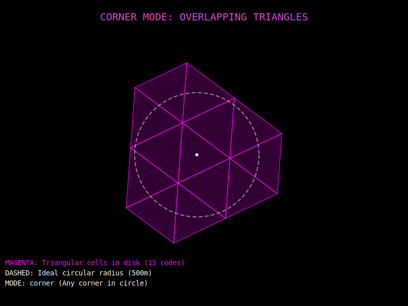
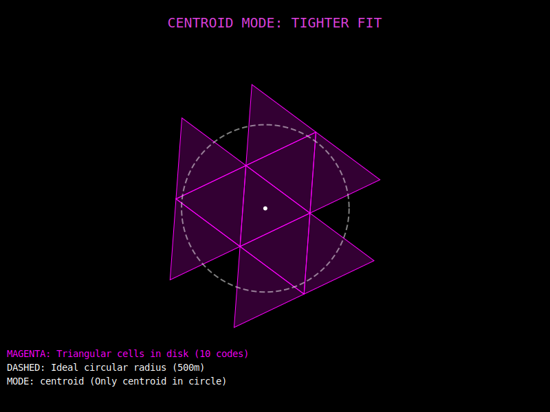

# Ambit: Icosahedral Gnomonic Aperture 4 Triangles

Ambit is a high-performance Erlang implementation of a hierarchical discrete global
grid system (DGGS). It uses an **Aperture 4** hierarchy mapped onto the 20 faces of
an **icosahedron** using a **gnomonic projection**.

## What is Ambit?

Ambit divides the Earth's surface into a hierarchy of triangular cells. Unlike
traditional Lat/Lon coordinates, which vary in physical distance depending on latitude,
Ambit provides a mathematically stable way to index and search spatial data.

### Why Triangles?
This project transitioned from hexagons to triangles for several key reasons:
*   **Exact Icosahedral Fit**: The 20 faces of an icosahedron are triangles. Triangles
    tile these faces perfectly without gaps or overlaps.
*   **No Pentagons**: Hexagonal grids on a sphere are mathematically impossible without
    introducing exactly 12 pentagons (singularities). Triangular grids can be subdivided
    infinitely while maintaining perfect structural consistency.
*   **Aperture 4 Hierarchy**: Each triangle is divided into 4 smaller triangles in the
    next resolution by connecting the midpoints of its edges. This provides a smooth,
    consistent scaling factor of 2.0x in edge length per level.

### Key Characteristics:
*   **Icosahedral Projection**: By using 20 triangular faces to represent the sphere,
    Ambit minimizes the "map distortion" found in equirectangular projections (like
    standard Web Mercator).
*   **Gnomonic Mapping**: Central projection from the Earth's center to the face planes
    ensures that great circles are represented as straight lines, making navigation and
    neighbor-finding computationally efficient.
*   **Base-20 Face Encoding**: Cell IDs are represented as `Face-Digits` (e.g., `0-213123...`),
    where the face is base-20 (0-9, a-j).

---

## Visualizing the Grid

Ambit provides a visualization tool (`ambit_viz.escript`) that generates an interactive
Leaflet map to inspect the grid.

### 1. The Global Structure (Faces)
The Earth is first divided into 20 icosahedral faces. Each face acts as its own local
coordinate system, significantly reducing distortion at the poles.


*(Diagram showing the 20 icosahedral faces mapped to the globe)*

### 2. Hierarchical Scaling (Aperture 4)
As you increase the resolution, each triangle is divided into four child triangles. One
is centered (inverted relative to the parent) and three occupy the corners.


*(Diagram showing nested triangular cells)*

### 3. Circular Proximity (Disks)
To approximate a circle on the globe, Ambit provides a `disk/3` function that returns
a set of triangular cells. These cells together cover the requested circular area.

Ambit supports two modes for selecting triangles:
*   **`corner` (default)**: Includes a triangle if **at least one** of its corners or its
    centroid falls within the circle. This ensures full coverage (no gaps) but may
    slightly overshoot the radius.
*   **`centroid`**: Includes a triangle **only** if its centroid falls within the circle.
    This provides a tighter fit to the radius but may leave small gaps at the edges.

| Corner Mode (Full Coverage) | Centroid Mode (Tight Fit) |
| :---: | :---: |
|  |  |

---

## Resolution Table

| Level | Cell ø | Level | Cell ø | Level | Cell ø |
| :--- | :--- | :--- | :--- | :--- | :--- |
| **1** | ~4000 km | **9** | ~15.5 km | **17** | ~61 m |
| **2** | ~2000 km | **10** | ~7.8 km | **18** | ~30 m |
| **3** | ~977 km | **11** | ~3.9 km | **19** | ~15 m |
| **4** | ~500 km | **12** | ~1.9 km | **20** | ~7.6 m |
| **5** | ~249 km | **13** | ~969 m | **21** | ~3.8 m |
| **6** | ~124 km | **14** | ~485 m | **22** | ~1.9 m |
| **7** | ~62 km | **15** | ~242 m | **23** | ~0.9 m |
| **8** | ~31 km | **16** | ~121 m | **24** | ~0.5 m |

---

## Usage

### Encoding a Coordinate
```erlang
% Encode Amsterdam (Lat: 52.3676, Lon: 4.9041) at Level 17
Code = ambit:encode({52.3676, 4.9041}, 17).
% Result: <<"0-21312323330031321">>
```

### Finding Neighbors
```erlang
% Get the immediate neighbors of a cell
Neighbors = ambit:neighbors(Code).
```

### Generating the Visualization
Run the provided escript to generate `ambit_viz.html`:
```bash
./ambit_viz.escript 52.3676 4.9041 15
```

---

## Spatial Queries with Prefix Matching

Because codes are hierarchical, **truncating a code to N digits gives its parent cell at
resolution N**. Two codes that share a prefix are guaranteed to be in the same coarser cell.
This lets you replace expensive distance calculations with simple string prefix operations.

### Visibility-Radius Filtering (Dual-Disk Pattern)

To find all items within a certain radius of a viewer without expensive distance
calculations, Ambit uses a **Dual-Disk** pattern.

#### How Disks Work
A single Ambit code covers a **triangular** cell. To approximate a **circular**
visibility area, `ambit:disk/3` returns the set of triangle codes whose union
covers the circle.

1.  **Approximation**: The "disk" is a collection of triangles that approximate the
    ideal circular area.
2.  **Selection Modes**:
    *   `corner`: (Default) Guaranteed coverage. If any part of the triangle touches the
        radius, it's included.
    *   `centroid`: Optimized fit. Only included if the center of the triangle is inside.
3.  **Privacy Centering**: By default, the disk is **not** centered on your exact
    GPS coordinates. Instead, it is snapped to the **orthocenter** of a coarser
    parent cell. This ensures that everyone within the same neighborhood generates the
    *exact same set of disk codes*, preventing high-precision tracking.
4.  **Optimal Resolution**: Use `ambit:optimal_level(Diameter)` to find the resolution
    where the triangles are roughly the same size as your search radius. This minimizes
    the number of codes you need to store and query.

```erlang
%% Item at {Lat, Lon}, visible within 1000 m
Res = ambit:optimal_level(1000).

%% Mode 1: Corner (default) - no gaps, slightly larger
Codes1 = ambit:disk({Lat, Lon}, Res, 1000, corner).

%% Mode 2: Centroid - tighter fit
Codes2 = ambit:disk({Lat, Lon}, Res, 1000, centroid).
```

#### Query Pattern
The viewer encodes their location and search disk, then checks overlap in both directions:

```erlang
%% Viewer at {VLat, VLon}, searching within 2000 m
SearchCodes = ambit:disk({VLat, VLon}, ?REF_LEVEL, 2000).
ViewerCode = ambit:encode({VLat, VLon}, ?REF_LEVEL).
```

```sql
SELECT * FROM items
WHERE code = ANY($1)                    -- item is in viewer's search area
  AND $2 = ANY(visibility_codes);       -- viewer is in item's visibility area
```

---

## Privacy Applications

Ambit is designed with privacy in mind. Because it is hierarchical, you can easily
"coarsen" a user's location by simply stripping digits from the end of their Cell ID.

To prevent global tracking, we recommend **Salted HMAC Hashing**:
1. Take a user's Cell ID (e.g., `0-213123...`).
2. Add a secret server-side pepper and the User's ID.
3. Store the hash: `HMAC_SHA256(Secret, UserID + CellID)`.

---

## License
Apache 2.0
