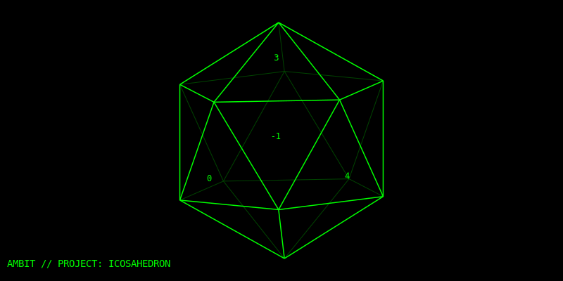
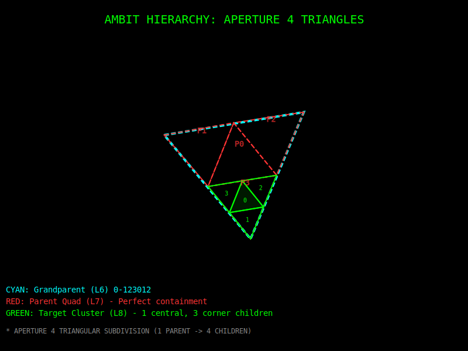

# Hexveil: Icosahedral Gnomonic Aperture 4 Hexagons

Hexveil is a high-performance Erlang implementation of a hierarchical discrete global
grid system (DGGS). It uses an **Aperture 4** hierarchy mapped onto the 20 faces of
an **icosahedron** using a **gnomonic projection**.

## What is Hexveil?

Hexveil divides the Earth's surface into a hierarchy of hexagonal cells. Unlike
traditional Lat/Lon coordinates, which vary in physical distance depending on latitude,
Hexveil provides a mathematically stable way to index and search spatial data.

### Key Characteristics:
*   **Aperture 4:** Each parent cell is divided into 4 smaller child cells in the next
    resolution. This provides a smooth, consistent scaling factor of 2.0x in edge length
    per level.
*   **Icosahedral Projection:** By using 20 triangular faces to represent the sphere,
    Hexveil minimizes the "map distortion" found in equirectangular projections (like
    standard Web Mercator).
*   **Gnomonic Mapping:** Central projection from the Earth's center to the face planes
    ensures that great circles are represented as straight lines, making navigation and
    neighbor-finding computationally efficient.
*   **Base-4 Encoding:** Cell IDs are represented as `Face-Digits` (e.g., `0-213123...`),
    where the face is base-20 (0-9, a-j) and the digits represent the hierarchical path.

---

## Visualizing the Grid

Hexveil provides a visualization tool (`hexveil_viz.escript`) that generates an interactive
Leaflet map to inspect the grid.

### 1. The Global Structure (Faces)
The Earth is first divided into 20 icosahedral faces. Each face acts as its own local
coordinate system, significantly reducing distortion at the poles.


*(Diagram showing the 20 icosahedral faces mapped to the globe)*

### 2. Hierarchical Scaling (Aperture 4)
As you increase the resolution, each hexagon precisely covers the center of its parent, with three other children surrounding it.


*(Diagram showing L17 cells nested within L16 and L15 parents)*

---

## Resolution Table

| Level | Approx. Diameter | Typical Use Case |
| :--- | :--- | :--- |
| **24** | ~2.5 m | High-precision / Human-scale tracking |
| **18** | ~160 m | Privacy-preserving proximity (Level 1) |
| **17** | ~320 m | Neighborhood-scale indexing |
| **9** | ~80 km | Regional / Meteorological data |
| **1** | ~20,000 km | Global / Continental scale |

---

## Usage

### Encoding a Coordinate
```erlang
% Encode Amsterdam (Lat: 52.3676, Lon: 4.9041) at Level 17
Code = hexveil:encode({52.3676, 4.9041}, 17).
% Result: <<"0-21312323330031321">>
```

### Finding Neighbors
```erlang
% Get the 6 immediate neighbors of a cell
Neighbors = hexveil:neighbors(Code).
```

### Generating the Visualization
Run the provided escript to generate `hexveil_viz.html`:
```bash
./hexveil_viz.escript 52.3676 4.9041 15
```
This will create a map showing the target cell and its surrounding neighborhood across
three resolution levels.

---

## Spatial Queries with Prefix Matching

Because codes are hierarchical, **truncating a code to N digits gives its parent cell at
resolution N**. Two codes that share a prefix are guaranteed to be in the same coarser cell.
This lets you replace expensive distance calculations with simple string prefix operations,
which databases can execute with a standard **btree index** (`LIKE 'prefix%'`).

### Shared-Prefix = Spatial Proximity

Looking at the hierarchical examples from the code:

| Location        | L24 (2.5m)                    | L17 (320m)            | L9 (80km)     |
| :---            | :---                          | :---                  | :---          |
| Vondelpark Ent. | `0-213123233300313032331123` | `0-21312323330031321` | `0-213123322` |
| Leidseplein     | `0-213123233300130310001202` | `0-21312323330013031` | `0-213123322` |
| Dam Square      | `0-213123233300100131120221` | `0-21312323330010102` | `0-213123322` |
| Dom Utrecht     | `0-213123321210212311201233` | `0-21312332121021320` | `0-213123323` |

At L9 (~80 km), the three Amsterdam locations share `0-213123322` while Dom Utrecht
(~40 km away) is `0-213123323`. A prefix search on `0-213123322%` would include all
Amsterdam items and exclude Utrecht — with zero distance calculations.

### Simple Proximity Search

To find all items within ~1000 m of a viewer, truncate the viewer's code to a resolution
whose cell diameter covers 1000 m (L15 ≈ 1280 m), then do a prefix match:

```sql
-- $1 = viewer's code truncated to L15 (e.g. '0-213123233300313')
SELECT * FROM items
WHERE code LIKE $1 || '%';
```

This is a btree range scan — O(log n) to find the start, then a sequential read of
only the matching rows.

### Visibility-Radius Filtering (Dual-Disk Pattern)

The original question: user A wants to see 1000 m around their location, but user B
(800 m away) wants to be visible only within 500 m. How is B excluded without
calculating the distance to every user?

**At write time**, store each item with a `visibility_code` — the item's code truncated
to the resolution matching its visibility radius:

```erlang
%% User B at {Lat, Lon}, visible within 500 m → use L16 (~640 m)
Code = hexveil:encode({Lat, Lon}, 24),       %% full precision code
VisibilityCode = hexveil:parent(              %% truncate to L16
    hexveil:encode({Lat, Lon}, 16)),
%% Store both: code and visibility_code
```

```sql
-- items table
--   code            text   -- full-resolution code (L24)
--   visibility_code text   -- code truncated to visibility radius resolution
CREATE INDEX idx_items_code ON items (code);
```

**At query time**, the viewer uses two prefix checks:

```sql
-- $search_prefix = viewer's code truncated to search radius (L15 for ~1000 m)
-- $viewer_code   = viewer's full-resolution code (L24)

SELECT * FROM items
WHERE code LIKE $search_prefix || '%'              -- item is in viewer's search area
  AND $viewer_code LIKE visibility_code || '%';    -- viewer is inside item's visibility cell
```

**Why user B is excluded:** B's `visibility_code` is at L16 (~640 m). User A is 800 m
away, so A's full code does **not** share B's L16 prefix — the second `LIKE` check fails.
No per-row distance calculation needed.

### Using `disk/2` for Exact Circular Coverage

A single triveil code covers a **triangular** cell. To approximate a **circular**
visibility area, `triveil:disk/3` returns the set of triangle codes whose union
covers the circle. Each item stores this set as its `visibility_codes`.

**Privacy:** The disk is always centered on the **parent triangle's centroid**, not
the exact user location. All users within the same parent cell produce identical
disk sets, preventing reverse-engineering of precise positions from stored codes.

#### Generating Visibility Codes

```erlang
%% Item at {Lat, Lon}, visible within 1000 m
%% Step 1: Pick the level that minimizes the number of codes
Res = triveil:optimal_level(1000).       %% => 13  (cell ≈ 969 m)

%% Step 2: Generate the disk codes at that level
VisibilityCodes = triveil:disk({Lat, Lon}, Res, 1000).
%% => [<<"0-1312312">>, <<"0-1312310">>]  (~2 codes at optimal level)
```

#### Storage Schema

Each item stores its location at a **fixed reference level** plus its visibility disk
codes at that same level. All items and all queries use the **same level** so that
code comparisons are meaningful. Choose one level for your application (e.g. L14 ≈
485 m cells for ~500 m precision):

```sql
CREATE TABLE items (
    id               bigint PRIMARY KEY,
    code             text NOT NULL,       -- item's triveil code at the reference level
    visibility_codes text[] NOT NULL,     -- disk codes at the reference level
    ...
);

-- GIN index for array overlap/containment queries
CREATE INDEX idx_items_visibility ON items USING GIN (visibility_codes);
```

```erlang
%% Application-wide reference level (pick once, use everywhere)
-define(REF_LEVEL, 14).   %% ~485 m cells

%% At write time: item at {Lat, Lon}, visible within 1000 m
Code = triveil:encode({Lat, Lon}, ?REF_LEVEL),
VisibilityCodes = triveil:disk({Lat, Lon}, ?REF_LEVEL, 1000).
%% Store: code = Code, visibility_codes = VisibilityCodes
```

#### Query Pattern (Dual-Disk)

At query time, the viewer encodes their location and search disk at the **same
reference level**, then checks overlap in both directions:

```erlang
%% Viewer at {VLat, VLon}, searching within 2000 m
ViewerCode = triveil:encode({VLat, VLon}, ?REF_LEVEL),
SearchCodes = triveil:disk({VLat, VLon}, ?REF_LEVEL, 2000).
```

```sql
-- $1 = SearchCodes  (viewer's search disk at REF_LEVEL)
-- $2 = ViewerCode   (viewer's own code at REF_LEVEL)

SELECT * FROM items
WHERE code = ANY($1)                    -- item is in viewer's search area
  AND $2 = ANY(visibility_codes);       -- viewer is in item's visibility area
```

Because all codes use the same reference level, direct equality works. The GIN index
on `visibility_codes` makes the second condition fast.

**How it works:**
- `code = ANY($1)`: the item's location cell is one of the cells in the viewer's
  search disk → the item is close enough to potentially be seen.
- `$2 = ANY(visibility_codes)`: the viewer's location cell is one of the cells in
  the item's visibility disk → the item *wants* to be seen by someone at the
  viewer's location.

**Example:** Item B is visible within 500 m (its `visibility_codes` covers ~500 m).
Viewer A is 800 m away, searching within 2000 m. B's `code` is inside A's search
disk (first check passes), but A's code is *not* in B's 500 m `visibility_codes`
(second check fails). B is correctly excluded — with zero distance calculations.

#### Visualizing a Disk

Run the triveil visualizer with a fourth argument to see the disk:

```bash
./triveil_viz.escript 52.3676 4.9041 13 1000
```

This generates `triveil_viz.html` showing the triangular cells (magenta fill) that
compose the 1000 m visibility disk, overlaid with a dashed reference circle for
comparison. An info panel shows the code count and optimal level.

### Choosing the Optimal Level for `visibility_codes`

A single triveil code covers a **triangular** cell, not a circle. To approximate a
circular visibility area, `triveil:disk/3` returns multiple codes — but the number
depends heavily on which resolution level you choose. Each level halves the cell
diameter (aperture 4), so going one level finer **quadruples** the code count.

Use `triveil:optimal_level/1` to pick the level that minimizes the number of codes:

```erlang
%% Find the level whose cells best match a 1000 m visibility diameter
Res = triveil:optimal_level(1000).    %% => 13

%% Generate the visibility disk at that level
Codes = triveil:disk({Lat, Lon}, Res, 1000).
%% => ~6 codes (gap-free circle coverage at optimal level)
```

The table below shows how the code count grows as the level gets finer, for a
visibility diameter of 1000 m (measured at Amsterdam, 52.37°N):

| Level | Cell Diameter | Codes in disk(1000m) | Shape |
| :--- | :--- | :--- | :--- |
| **12** | ~1938 m | 1 | Single triangle (overshoots by ~2×) |
| **13** | ~969 m | 1 | ← **optimal** (best fit, minimal overshoot) |
| **14** | ~485 m | 13 | Rough circle |
| **15** | ~242 m | 47 | Smooth circle |
| **16** | ~121 m | 165 | Very precise circle |

**Rule of thumb:** pick the level where `cell diameter ≈ visibility diameter`. At
that level the parent-centered disk uses the fewest codes with the least overshoot.
Going finer gives a rounder shape but with exponentially more codes to store and
query.

The full cell-diameter table for triveil:

| Level | Cell ø | Level | Cell ø | Level | Cell ø |
| :--- | :--- | :--- | :--- | :--- | :--- |
| **1** | ~4000 km | **9** | ~15.5 km | **17** | ~61 m |
| **2** | ~2000 km | **10** | ~7.8 km | **18** | ~30 m |
| **3** | ~977 km | **11** | ~3.9 km | **19** | ~15 m |
| **4** | ~500 km | **12** | ~1.9 km | **20** | ~7.6 m |
| **5** | ~249 km | **13** | ~969 m | **21** | ~3.8 m |
| **6** | ~124 km | **14** | ~485 m | **22** | ~1.9 m |
| **7** | ~62 km | **15** | ~242 m | **23** | ~0.9 m |
| **8** | ~31 km | **16** | ~121 m | **24** | ~0.5 m |

---

## Privacy Applications

Hexveil is designed with privacy in mind. Because it is hierarchical, you can easily
"coarsen" a user's location by simply stripping digits from the end of their Cell ID.

To prevent global tracking, we recommend **Salted HMAC Hashing**:
1. Take a user's Cell ID (e.g., `0-213123...`).
2. Add a secret server-side pepper and the User's ID.
3. Store the hash: `HMAC_SHA256(Secret, UserID + CellID)`.

This ensures that even if your database is compromised, the physical locations cannot
be recovered without the secret key.

---

## License
Apache 2.0
